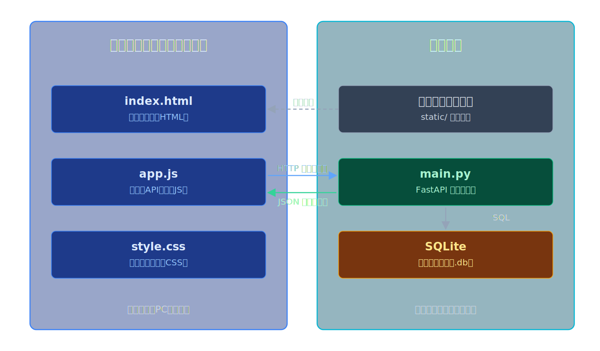
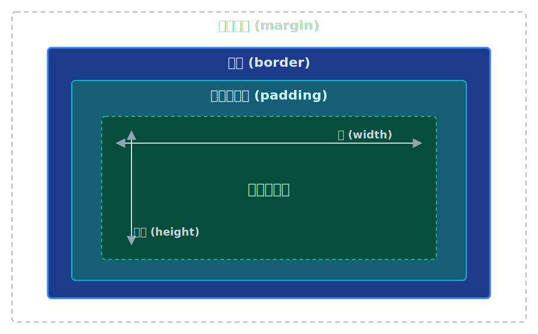
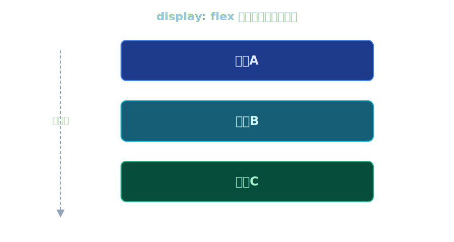
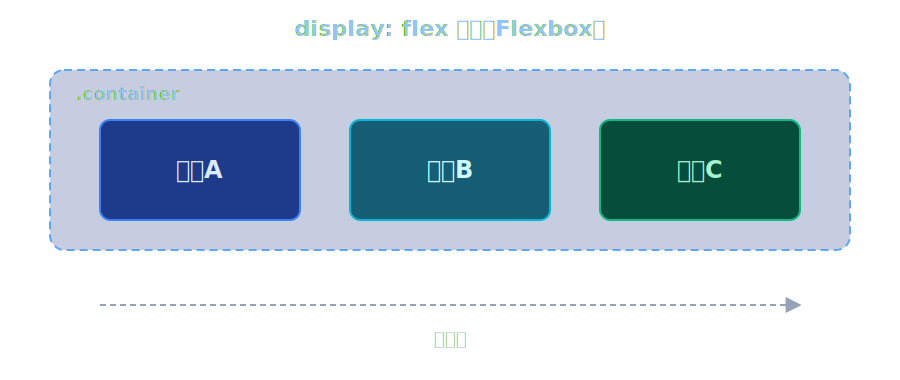
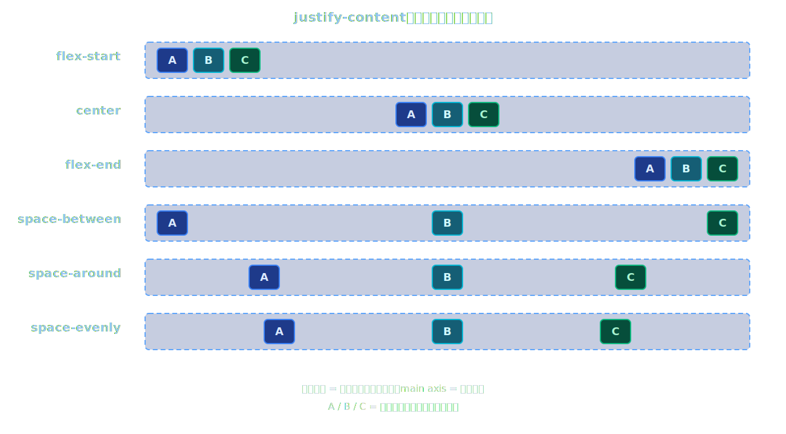
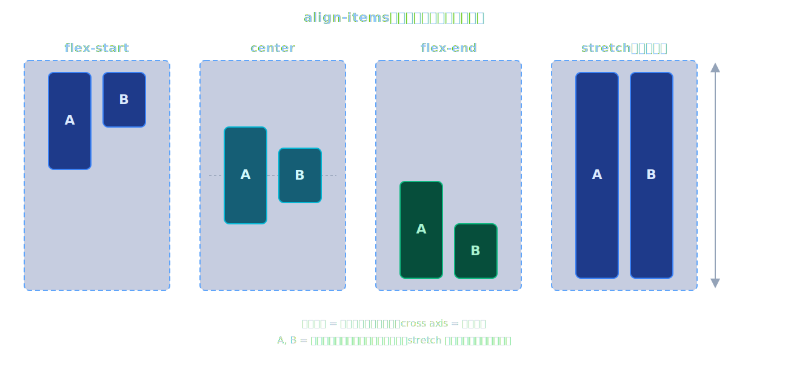
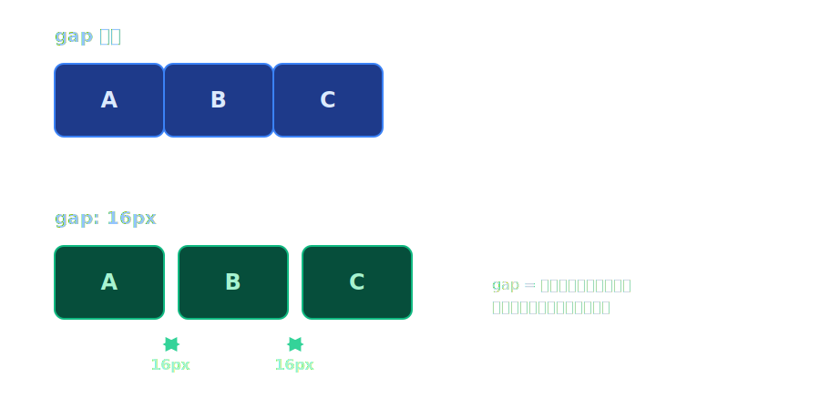

# 第3回: CSS基礎 — TODOアプリの見た目を整える

**Webアプリケーション基礎 2026**

---

## 今日のゴール

CSSを使って、第2回で作ったTODOアプリの見た目を整える

HTMLは「構造」を定義する言語。見た目の制御は **CSS** の役割。

---



---

## 今日の流れ

**前半**
- CSSとは・適用方法3つ
- セレクタと基本プロパティ
- ボックスモデル

**後半**
- Flexboxレイアウト
- レスポンシブデザイン基礎
- TODOアプリのCSS設計

> すべて **ブラウザ（クライアント側）** で動作する技術です。

---


# 前半: CSS基礎

---

<!-- セクション1: CSSとは -->

## 1. CSSとは

**CSS = Cascading Style Sheets**

- HTML が「**構造**（骨格）」を定義する
- CSS が「**見た目**（装飾）」を定義する
- ブラウザが HTML と CSS の両方を読み込み、画面を描画する


※ブラウザ側（クライアント側）で実行される

---

## CSSの基本的な書き方

```css
セレクタ {
  プロパティ: 値;
  プロパティ: 値;
}
```

### 例

```css
h1 {
  color: blue;
  font-size: 32px;
}
```

- **セレクタ**: どの要素に適用するか（ここでは `h1` タグ）
- **プロパティ**: 何を変えるか（`color` = 文字色）
- **値**: どう変えるか（`blue` = 青色）

---

## CSSの適用方法は3つある

| 方法 | 書き方 | 特徴 |
|------|--------|------|
| **1. インラインスタイル** | HTMLタグに直接 `style` 属性 | 手軽だが再利用不可 |
| **2. styleタグ** | `<head>` 内に `<style>` | 1ファイルで完結 |
| **3. 外部CSSファイル** | `.css` ファイルを `<link>` で読み込み | 推奨。再利用しやすい |

---

## 方法1: インラインスタイル

HTMLタグの `style` 属性に直接書く。

```html
<h1 style="color: red; font-size: 40px;">こんにちは</h1>
<p style="background-color: yellow;">黄色の背景です</p>
```

- メリット: すぐ試せる
- デメリット: タグごとに書く必要があり、管理が大変

---

## 方法2: styleタグ

`<head>` の中に `<style>` タグで書く。

```html
<head>
  <style>
    h1 {
      color: red;
      font-size: 40px;
    }
    p {
      background-color: yellow;
    }
  </style>
</head>
```

- メリット: まとめて管理できる
- デメリット: 他のHTMLファイルで再利用できない

---

## 方法3: 外部CSSファイル（推奨）

CSSを別ファイルに書き、`<link>` タグで読み込む。

**style.css**
```css
h1 {
  color: red;
  font-size: 40px;
}
```

**index.html**
```html
<head>
  <link rel="stylesheet" href="style.css">
</head>
```

- メリット: 複数ページで共有可能。HTMLとCSSが分離されて管理しやすい
- **実際の開発ではこの方法が標準**

---

## 実習1（10分）: 3つの適用方法を試す

1. **インラインスタイル**: `todo.html` の `<h1>` に `style="color: blue;"` を追加して表示確認
2. **styleタグ**: `<head>` 内に `<style>` を追加して `h1` の色を変更
3. **外部ファイル**: `style.css` を新規作成し、`<link>` で読み込む

最終的に**外部ファイル方式**に統一してください。

```html
<!-- todo.html の <head> に追加 -->
<link rel="stylesheet" href="style.css">
```

---

<!-- セクション2: セレクタと基本プロパティ -->

## 2. セレクタの種類

CSSでは「どの要素にスタイルを適用するか」をセレクタで指定する。

---

## タグセレクタ

HTMLのタグ名をそのまま書く。**そのタグ全部**に適用される。

```css
h1 {
  color: blue;
}

p {
  font-size: 16px;
}
```

- ページ内の **すべての** `h1` や `p` に適用される
- 広い範囲に共通スタイルを適用したいときに使う

---

## クラスセレクタ

HTML要素に `class` 属性をつけ、CSSでは `.クラス名` で指定する。

```html
<p class="highlight">重要なテキスト</p>
<p>普通のテキスト</p>
<p class="highlight">これも重要</p>
```

```css
.highlight {
  background-color: yellow;
  font-weight: bold;
}
```

- **複数の要素**に同じクラスを付けられる
- 最もよく使うセレクタ

---

## IDセレクタ

HTML要素に `id` 属性をつけ、CSSでは `#ID名` で指定する。

```html
<h1 id="page-title">タイトル</h1>
```

```css
#page-title {
  color: darkblue;
  text-align: center;
}
```

- **ページ内で1つだけ**の要素に使う
- クラスセレクタの方が汎用的なので、IDは限定的に使う

---

## 基本プロパティ一覧

| プロパティ | 効果 | 値の例 |
|-----------|------|--------|
| `color` | 文字色 | `red`, `#333333`, `rgb(0,0,255)` |
| `font-size` | 文字サイズ | `16px`, `1.2em`, `1.5rem` |
| `font-family` | フォント | `sans-serif`, `"Noto Sans JP"` |
| `background-color` | 背景色 | `#f0f0f0`, `lightblue` |
| `text-align` | 文字揃え | `left`, `center`, `right` |
| `font-weight` | 文字の太さ | `normal`, `bold`, `700` |

---

## 色の指定方法

```css
/* 色の名前 */
color: red;

/* 16進数（よく使う） */
color: #2563eb;

/* RGB */
color: rgb(37, 99, 235);

/* 透明度付き */
color: rgba(37, 99, 235, 0.5);
```

---

## 実習2（10分）: セレクタとプロパティを試す

`todo.html` にスタイルを適用。

1. `h1` タグセレクタで見出しの色を変更
2. HTMLに `class="todo-item"` を追加し、クラスセレクタでスタイル適用
3. 以下のプロパティを自由に試す
   - `color` で文字色変更
   - `font-size` で文字サイズ変更
   - `background-color` で背景色変更
   - `text-align: center` で中央揃え

---

<!-- セクション3: ボックスモデル -->

## 3. ボックスモデル

CSSでは、**すべての要素は「箱（ボックス）」** として扱われる。

---

## ボックスモデルの構造

<div class="columns">
<div>

| 領域 | 役割 | CSSプロパティ |
|------|------|-------------|
| **content** | テキストや画像などの中身 | `width`, `height` |
| **padding** | コンテンツと境界線の間の余白 | `padding` |
| **border** | 要素の境界線 | `border` |
| **margin** | 他の要素との間の余白 | `margin` |

</div>
<div>



</div>
</div>

---

## margin と padding の違い

<div class="columns">
<div>

- **margin**: 要素の**外側**の余白。隣の要素との距離
- **padding**: 要素の**内側**の余白。コンテンツと枠線の距離

</div>
<div>


</div>
</div>

---

## ボックスモデルのCSS

```css
.card {
  width: 300px;
  height: 200px;
  padding: 20px;
  border: 2px solid #333;
  margin: 10px;
}
```

### 上下左右を個別指定

```css
padding-top: 10px;
padding-right: 20px;
padding-bottom: 10px;
padding-left: 20px;

/* ショートハンド: 上 右 下 左（時計回り） */
padding: 10px 20px 10px 20px;
```

---

## 開発者ツールでボックスモデルを確認

1. https://ja.wikipedia.org/wiki/%E3%83%A1%E3%82%A4%E3%83%B3%E3%83%9A%E3%83%BC%E3%82%B8 を開く
2. ブラウザで **F12** キーを押して開発者ツールを開く
3. **Elements** タブを選択
4. 調べたい要素をクリック
5. 右側パネルの **Computed** タブを開く
6. ボックスモデルの図が表示される

開発者ツールでは、各領域のサイズが数値で確認できる。
margin / padding / border / content それぞれの値を変更して即座にプレビューも可能。

---

## 実習3（10分）: ボックスモデルを体感する

1. `style.css` に以下を追加して表示を確認

```css
.box-demo {
  width: 200px;
  padding: 20px;
  border: 3px solid blue;
  margin: 30px;
  background-color: lightyellow;
}
```

2. **開発者ツール**（F12）を開き、Computedタブでボックスモデルを確認
3. 開発者ツール上で `padding` や `margin` の値を変更してみる
4. `margin` と `padding` の違いを目で見て体感する

---


# 後半: レイアウトとTODOアプリの装飾

---

<!-- セクション4: Flexbox -->

## 4. Flexboxレイアウト

CSSで要素を**横並び**にしたり、**中央配置**するための仕組み。

---

## Flexboxの基本

```css
.container {
  display: flex;
}
```

**`display: flex` を親要素に指定する**と、子要素が横並びになる。

<div class="columns">
<div>

**通常（display: flex なし）:**



</div>
<div>

**Flexbox（display: flex あり）:**



</div>
</div>

---

## justify-content（横方向の配置）

```css
.container {
  display: flex;
  justify-content: center;  /* 中央に配置 */
}
```



---

## align-items（縦方向の配置）

```css
.container {
  display: flex;
  align-items: center;  /* 縦方向で中央 */
}
```



---

## gap（要素間の隙間）

```css
.container {
  display: flex;
  gap: 16px;
}
```



- `margin` で間隔を作るより、`gap` の方がシンプルで管理しやすい

---

## Flexboxの使用例: ヘッダー

```html
<header class="header">
  <h1>TODO App</h1>
  <nav>メニュー</nav>
</header>
```

```css
.header {
  display: flex;
  justify-content: space-between;  /* 左右に分ける */
  align-items: center;             /* 縦方向で中央 */
  padding: 16px;
  background-color: #2563eb;
  color: white;
}
```


---

## 実習4（10分）: Flexboxを試す

1. ヘッダーの要素を横並びにする

```css
.header { display: flex; justify-content: space-between; align-items: center; }
```

2. 入力フォームを横並びにする

```css
.input-area { display: flex; gap: 8px; }
```

3. ページ全体を中央配置するカードレイアウトを作る

```css
body { display: flex; justify-content: center; }
```

---

<!-- セクション5: レスポンシブデザイン -->

## 5. レスポンシブデザイン基礎

画面サイズに応じてレイアウトを調整する技術。

---

## meta viewport

スマートフォンで正しく表示するために必要な設定。

```html
<head>
  <meta name="viewport" content="width=device-width, initial-scale=1.0">
</head>
```

- **この1行がないと、スマホで見たときにPC向けの小さい表示になる**
- 第2回で作った `todo.html` にすでに含まれているか確認しよう

---

## max-width で幅を制限

```css
.todo-card {
  max-width: 600px;
  width: 100%;         /* 画面幅が狭ければ画面幅に合わせる */
  margin: 40px auto;
}
```


---

## メディアクエリ

画面幅に応じてCSSを切り替える仕組み。

```css
/* 通常のスタイル（PC向け） */
.todo-card {
  padding: 32px;
}

/* 画面幅が768px以下のとき（タブレット・スマホ） */
@media (max-width: 768px) {
  .todo-card {
    padding: 16px;
    margin: 16px;
  }
}
```

---

## メディアクエリの代表的なブレークポイント

| ブレークポイント | 対象デバイス |
|---------------|-------------|
| `max-width: 480px` | スマートフォン（縦） |
| `max-width: 768px` | タブレット |
| `max-width: 1024px` | 小さいPC画面 |

```css
@media (max-width: 480px) {
  .header h1 { font-size: 20px; }
  .input-area { flex-direction: column; } /* 縦に並べる */
}
```

---

## 開発者ツールのデバイスモード

1. 開発者ツール（F12）を開く
2. 左上の **デバイスモード切替ボタン** をクリック（スマホ/タブレットのアイコン）
3. 上部のドロップダウンで端末を選択（iPhone, iPad など）
4. 画面幅を変えてレイアウトの変化を確認

実際のスマートフォンを使わなくても、レスポンシブデザインの確認ができる。

---

## 実習5（10分）: レスポンシブ対応

1. `todo.html` に `<meta name="viewport" ...>` があるか確認
2. `style.css` にメディアクエリを追加

```css
@media (max-width: 480px) {
  .todo-card { margin: 16px; padding: 16px; }
  .input-area { flex-direction: column; }
}
```

3. `todo.html` と `style.css` をダウンロードして、ブラウザで開く
4. 開発者ツールのデバイスモードでスマホ表示を確認

---

<!-- セクション6: TODOアプリのCSS設計 -->

## 6. TODOアプリのCSS設計

前半で学んだ知識を使って、TODOアプリを実際にデザインする。


---

## CSS設計のポイント

### 1. 全体のリセットと基本設定

```css
* {
  margin: 0;
  padding: 0;
  box-sizing: border-box;
}

body {
  font-family: "Helvetica Neue", Arial, "Hiragino Sans",
               "Noto Sans JP", sans-serif;
  background-color: #f3f4f6;
  color: #333;
}
```

- `*` で全要素のデフォルトmargin/paddingをリセット
- `box-sizing: border-box` でサイズ計算を直感的に

---

## CSS設計のポイント（続き）

### 2. カードデザイン

```css
.todo-card {
  background-color: white;
  max-width: 600px;
  margin: 40px auto;       /* 上下40px、左右は自動で中央配置 */
  padding: 32px;
  border-radius: 12px;     /* 角を丸くする */
  box-shadow: 0 2px 8px rgba(0, 0, 0, 0.1);  /* 影 */
}
```

- `margin: 40px auto` で左右中央配置
- `border-radius` で角丸
- `box-shadow` で浮き出るような影

---

## CSS設計のポイント（続き）

### 3. 入力欄とボタン

```css
.todo-input {
  flex: 1;                  /* 残りの幅を使い切る */
  padding: 12px 16px;
  border: 2px solid #d1d5db;
  border-radius: 8px;
  font-size: 16px;
}

.todo-button {
  padding: 12px 24px;
  background-color: #2563eb;
  color: white;
  border: none;
  border-radius: 8px;
  cursor: pointer;          /* ポインターに変える */
}
```

---

## CSS設計のポイント（続き）

### 4. ホバー効果

マウスカーソルを乗せたときに見た目を変える。

```css
.todo-button:hover {
  background-color: #1d4ed8;  /* 少し暗く */
}

.todo-item:hover {
  background-color: #f9fafb;  /* 薄く色が変わる */
}
```

- `:hover` は「マウスが乗っているとき」の**擬似クラス**
- ユーザーに「クリックできる」ことを視覚的に伝える

---

## 実習6（10分）: TODOアプリにCSSを適用しGit push

### 事前準備

実習1〜3で `todo.html` に追加した試験用コードを整理してから始める。

1. 実習1で追加したインラインスタイル（`style="..."`）と `<style>` タグの中身を削除する
2. 実習3で追加した `box-demo` クラスのHTML要素があれば削除する
3. `<head>` 内の外部CSS読み込みのコメントを外す
   ```html
   <link rel="stylesheet" href="style.css" />
   ```

### スタイルの追加

`style.css` に以下の順番でスタイルを追加していく。

1. 全体リセット（`*` セレクタで margin/padding を 0 に）
2. `body` の背景色・フォント設定
3. ヘッダーのスタイル（背景色、文字色、padding）
4. カードデザイン（白背景、角丸、影）
5. 入力欄の装飾（padding、border-radius）
6. ボタンの装飾（背景色、文字色、角丸）
7. TODOリスト項目のスタイル
8. ホバー効果の追加

随時プレビューしながら進めましょう。

---

完成したら Git commit & push

```bash
git add todo.html style.css
git commit -m "第3回: TODOアプリにCSS適用"
git push
```

---

## 第3回のまとめ

| 学んだこと | キーワード |
|-----------|-----------|
| CSS適用方法 | インライン, styleタグ, 外部ファイル |
| セレクタ | タグ, クラス(`.`), ID(`#`) |
| 基本プロパティ | color, font-size, background-color |
| ボックスモデル | margin, padding, border, content |
| Flexbox | display:flex, justify-content, align-items, gap |
| レスポンシブ | viewport, max-width, メディアクエリ |

---

## 次回の予告: JavaScript基礎

- JavaScriptとは: ブラウザ上で動くプログラミング言語
- 変数、関数、条件分岐、ループ
- DOM操作: HTMLをJavaScriptから動的に変更する
- TODOの追加・完了・削除をプログラムで実装

**CSSで「見た目」を整えた次は、JavaScriptで「動き」をつけます。**

---

## 提出物

実習で穴埋め・実装を完了させたファイルをフォームから提出してください:

1. `style.css` のGitHubのURL
   - 例: `https://github.com/ユーザー名/リポジトリ名/blob/main/session03/exercise/style.css`

2. `todo.html` のGitHubのURL
   - 例: `https://github.com/ユーザー名/リポジトリ名/blob/main/session03/exercise/todo.html`
