# 第7回: フロントエンドとバックエンドの結合

**Webアプリケーション基礎 2026**

---

## 今日のゴール

フロントエンドとバックエンドを繋ぎ、フルスタックTODOアプリを完成させる

- フロントエンドからバックエンドのAPIを呼び出す
- 1つのサーバーでフルスタックTODOアプリを完成させる

---


---

## 今日の流れ

**前半**
- 全体アーキテクチャ総整理
- Fetch API（GET） — fetch, async/await, .json()
- Fetch API（POST） — method, headers, body

**後半**
- CORS — オリジン, CORSMiddleware
- 完了・削除の実装 — PUT, DELETE
- 静的ファイル配信 — StaticFiles

---


# 1. 全体アーキテクチャ総整理

## これまでの6回で学んだ技術の全体像

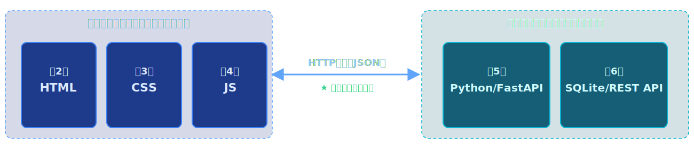

今回は **「繋ぐ」** 回です。

---


# データの流れ -- 全体図（前半）

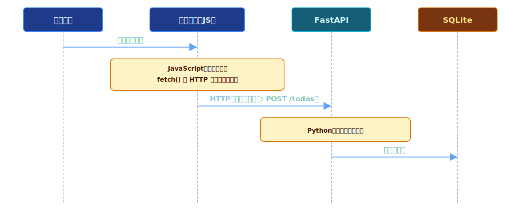

---


# データの流れ -- 全体図（後半）

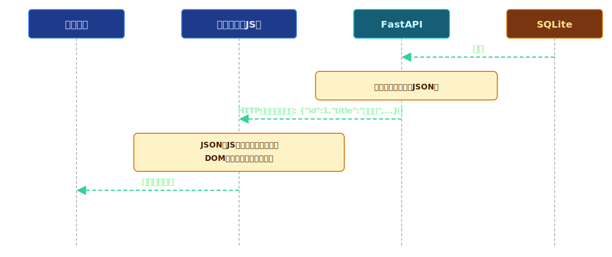

---


# 各ステップの実行場所

| ステップ | 何をする | 実行場所 | 使う技術 |
|---------|---------|---------|---------|
| 1 | ユーザーがボタンをクリック | ブラウザ | HTML |
| 2 | イベントハンドラが発火 | ブラウザ | JavaScript |
| 3 | HTTPリクエストを送信 | ブラウザ → サーバー | Fetch API |
| 4 | リクエストを受信・処理 | サーバー | FastAPI (Python) |
| 5 | データベース操作 | サーバー | SQLite (SQL) |
| 6 | JSONレスポンスを返す | サーバー → ブラウザ | FastAPI (JSON) |
| 7 | レスポンスを受け取る | ブラウザ | Fetch API |
| 8 | 画面を更新する | ブラウザ | JavaScript (DOM) |

**ポイント:** ステップ3〜6の間、ブラウザは「待っている」状態（非同期処理）

---


# なぜ「繋ぐ」必要があるのか

## 第4回の問題を思い出そう

<div class="columns">
<div>

**フロントエンドだけの場合**

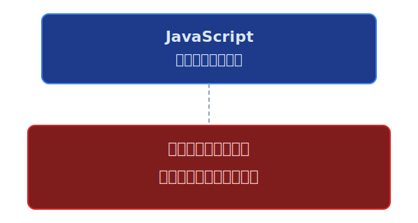

</div>
<div>

**バックエンドがある場合**

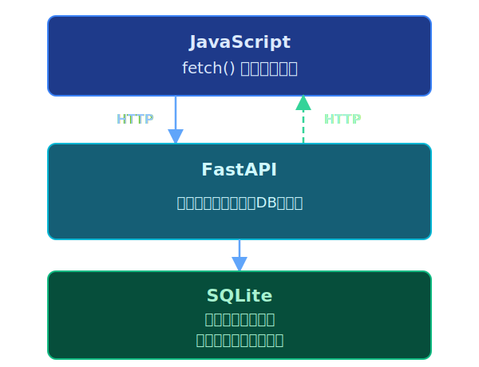

</div>
</div>

---


# 実習1: 通信フローの列挙

## やること（10分）

以下のシナリオについて、通信フローを列挙してください。

**シナリオ:** ユーザーが「牛乳を買う」と入力して追加ボタンを押す

1. テキストエディタでファイル `flow.md` を編集
2. 以下の各ステップを書き出す:
   - どこで何が起きるか
   - 実行場所は「ブラウザ」「サーバー」のどれか
   - 使う技術は何か

例：・サーバー上で新しいTODOをSQLiteでテーブルに保存する

**ヒント:** 前のスライドの表を参考に、自分の言葉で書いてみましょう

---


# 2. Fetch API（GET）

## JavaScriptからHTTPリクエストを送る方法

**Fetch API とは:**
- ブラウザに標準搭載されている機能
- JavaScriptからHTTPリクエストを送信できる
- 第1回で学んだHTTP通信を、プログラムから実行する

```
開発者ツールで手動確認       →   第1回〜第6回の方法
Swagger UIでAPIテスト      →   第6回の方法
JavaScriptから自動で通信    →   ★今回学ぶ方法（Fetch API）
```

---


# 非同期処理とは

## 料理の注文に例えると

```
同期処理（もし通信が同期だったら）:
  注文する → 料理が届くまで何もできない → 料理を受け取る → 食べる
  （画面がフリーズしてしまう！）

非同期処理（実際の通信）:
  注文する → 待っている間に他のことができる → 料理が届いたら食べる
  （画面は操作できたまま、裏で通信が進む）
```

**JavaScriptのHTTP通信は「非同期」** -- ブラウザがフリーズしないように、レスポンスを待つ間も他の処理が実行できる。

---


# fetch() の基本

## GETリクエストの書き方

```javascript
// 方法1: .then() チェーン
fetch("http://localhost:8000/todos")
  .then(response => response.json())  // レスポンスをJSONとして解析
  .then(data => {
    console.log(data);                // データを使う
  });

// 方法2: async/await（こちらを推奨）
async function getTodos() {
  const response = await fetch("http://localhost:8000/todos");
  const data = await response.json();
  console.log(data);
}
```

**`await`** = 「結果が届くまで待つ」という意味

---


# async/await を理解する

```
async function getTodos() {        ← async: 「この関数は非同期処理を含む」
                                      という宣言

  const response = await fetch(..);← await: 「サーバーからの返事を待つ」
                                      待っている間、ブラウザは固まらない

  const data = await response.json(); ← await: 「JSONへの変換を待つ」

  console.log(data);               ← データが届いてから実行される
}
```

**async と await はセット** -- `await` は `async` 関数の中でしか使えない

**`response.json()`** -- HTTPレスポンスの本文をJSONとして解析し、JavaScriptオブジェクト（配列や辞書）に変換する

---


# 実習2: Fetch APIでGETリクエスト

## やること（10分）

### 準備
1. ターミナルでバックエンドサーバーを起動:
   ```bash
   cd session07/exercise
   python init_db.py        # DB初期化
   python main.py
   ```

### 実習
2. `fetch-get-example.html` をダウンロードしてブラウザで表示
3. 「TODOを取得」ボタンをクリック
4. **開発者ツール → Console** でデータが表示されることを確認
5. **開発者ツール → Network** タブでHTTPリクエストを確認
   - リクエストURL、メソッド（GET）、レスポンス（JSON）を観察

---


# 3. Fetch API（POST）

## データをサーバーに送信する

GETは「データを取得する」だけでしたが、POSTは「データを送信する」ためのメソッドです。

```javascript
async function addTodo(title) {
  const response = await fetch("http://localhost:8000/todos", {
    method: "POST",                          // HTTPメソッドを指定
    headers: {
      "Content-Type": "application/json"     // 送るデータの形式を宣言
    },
    body: JSON.stringify({ title: title })   // JavaScriptオブジェクトを
  });                                        // JSON文字列に変換して送る
  const data = await response.json();
  console.log("追加されたTODO:", data);
}
```

---


# GET vs POST の違い

```
GET（データ取得）:
  fetch("/todos")
  → リクエスト本文なし
  → サーバーから「既存のデータ」を受け取る

POST（データ送信）:
  fetch("/todos", {
    method: "POST",
    headers: { "Content-Type": "application/json" },
    body: JSON.stringify({ title: "買い物" })
  })
  → リクエスト本文あり（JSON）
  → サーバーに「新しいデータ」を送る
```

| | GET | POST |
|---|---|---|
| 目的 | データ取得 | データ送信 |
| body | なし | あり（JSON） |
| headers | 不要 | Content-Type必要 |

---


# JSON.stringify() とは

## JavaScriptオブジェクトとJSON文字列の変換

```javascript
// JavaScriptオブジェクト（プログラム内で使う形）
const todo = { title: "牛乳を買う" };

// JSON文字列に変換（サーバーに送る形）
const jsonString = JSON.stringify(todo);
// → '{"title":"牛乳を買う"}'

// 逆変換: JSON文字列 → JavaScriptオブジェクト
const obj = JSON.parse('{"title":"牛乳を買う"}');
// → { title: "牛乳を買う" }
```

```
JavaScriptオブジェクト  ←──JSON.parse()────   JSON文字列
{ title: "..." }       ──JSON.stringify()→   '{"title":"..."}'
↑プログラム内                                 ↑通信用
```

---


# 追加ボタンの処理フロー

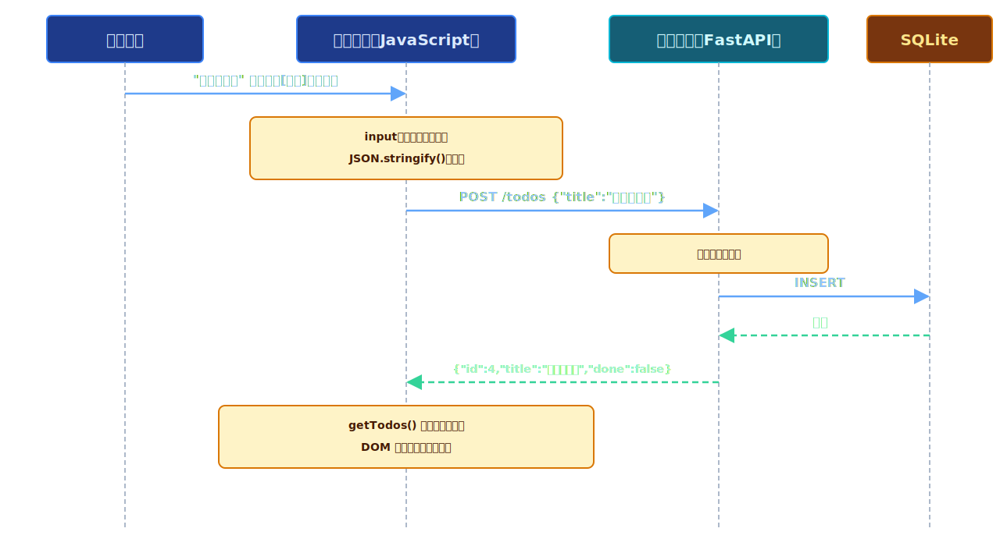

---


# 実習3: Fetch APIでPOSTリクエスト

## やること（10分）

1. `fetch-post-example.html` を開いてブラウザで表示
2. テキスト入力欄に TODO を入力し、「追加」ボタンをクリック
3. **Console** にサーバーからのレスポンスが表示されることを確認
4. **Network** タブで確認:
   - リクエストメソッドが **POST** であること
   - リクエストヘッダに **Content-Type: application/json** があること
   - リクエスト本文（Payload）に入力した内容がJSON形式で含まれること
   - レスポンスに `id` が付与されて返ってきていること
5. 「TODOを取得」ボタンを押して、追加したTODOが一覧に含まれていることを確認

---


# 4. CORSとは

## 異なるオリジン間の通信制限

**オリジン** = プロトコル + ホスト名 + ポート番号 の組み合わせ

```
http://localhost:5500   ← フロントエンド（HTMLファイルを開いている場所）
http://localhost:8000   ← バックエンド（FastAPIサーバー）
       ↑         ↑
   プロトコル   ポートが違う！ → 異なるオリジン
```

ブラウザは**セキュリティのため**、異なるオリジンへの通信をデフォルトでブロックする。

これが **CORS (Cross-Origin Resource Sharing)** の仕組み。

---


# CORSエラーが起きる流れ

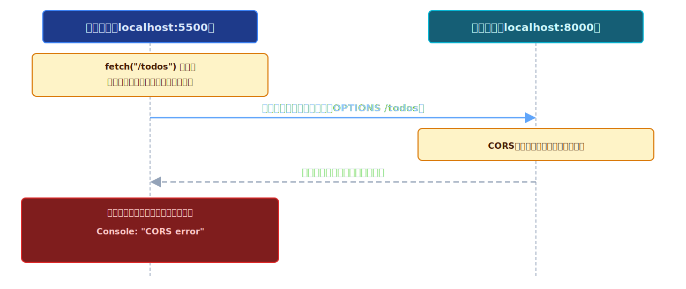

---


# CORSの解決方法

## FastAPIでCORSMiddlewareを設定する

```python
from fastapi.middleware.cors import CORSMiddleware

app = FastAPI()

# CORS設定を追加
app.add_middleware(
    CORSMiddleware,
    allow_origins=["*"],           # どのオリジンからのアクセスを許可するか
    allow_credentials=True,        #   "*" = すべて許可（開発時のみ推奨）
    allow_methods=["*"],           # どのHTTPメソッドを許可するか
    allow_headers=["*"],           # どのヘッダを許可するか
)
```

**設定後の流れ:**
サーバーが「このオリジンからのアクセスは許可します」とレスポンスヘッダに含める
→ ブラウザが通信を許可 → エラー解消

---


# CORS解決後の通信フロー

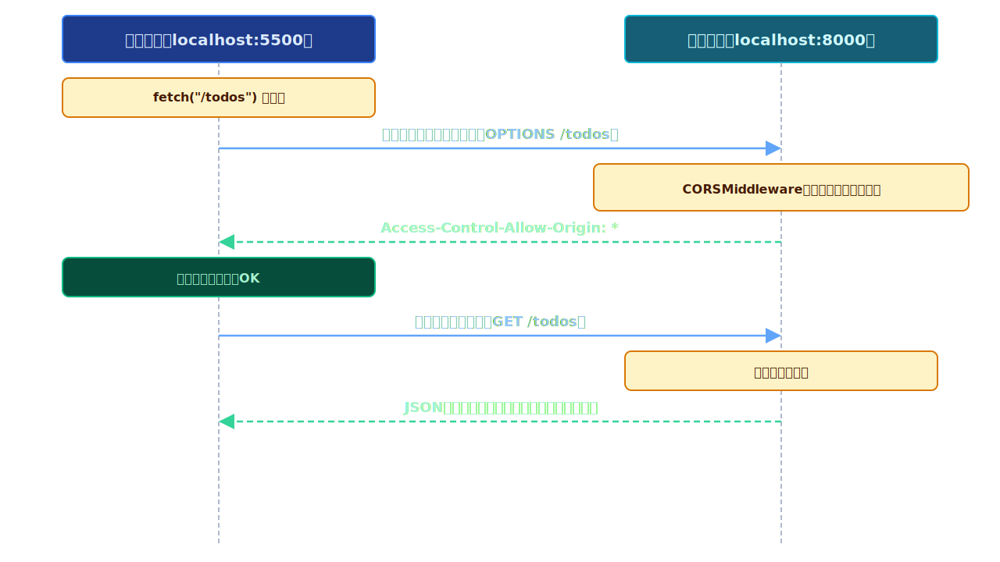

---


# 実習4: CORSエラー体験と解決

## やること（10分）

### Step 1: CORSエラーを体験する
1. `exercise/main.py` を確認 -- CORS設定がコメントアウトされている
2. サーバーを起動し、`fetch-get-example.html`のプレビューからAPIを呼び出す
3. CORSエラーが表示されることを確認

### Step 2: CORS設定を追加して解決する
4. `exercise/main.py` の CORS設定部分のコメントを外す
5. サーバーを再起動（Ctrl+C → python main.py）
6. 再度 `fetch-get-example.html` でAPIを呼び出す
7. CORSエラーが消えてデータが取得できることを確認

---


# 5. 完了・削除のフロントエンド実装

## PUT（完了切替）とDELETE（削除）

```javascript
// PUT: TODO完了状態の切替
async function toggleTodo(id, currentDone) {
  await fetch(`http://localhost:8000/todos/${id}`, {
    method: "PUT",
    headers: { "Content-Type": "application/json" },
    body: JSON.stringify({ done: !currentDone })   // 現在の反対にする
  });
  await getTodos();  // 一覧を再取得して画面を更新
}

// DELETE: TODOの削除
async function deleteTodo(id) {
  await fetch(`http://localhost:8000/todos/${id}`, {
    method: "DELETE"
  });
  await getTodos();  // 一覧を再取得して画面を更新
}
```

---


# 4つのHTTPメソッドとFetch API

## CRUD操作の完全な対応表

| 操作 | HTTPメソッド | エンドポイント | fetch()の書き方 |
|------|------------|--------------|----------------|
| 一覧取得 | GET | /todos | `fetch("/todos")` |
| 新規追加 | POST | /todos | `fetch("/todos", {method:"POST", ...body})` |
| 完了切替 | PUT | /todos/{id} | `fetch("/todos/1", {method:"PUT", ...body})` |
| 削除 | DELETE | /todos/{id} | `fetch("/todos/1", {method:"DELETE"})` |

**パターン:**
- **GET/DELETE**: body不要
- **POST/PUT**: headers + body が必要（JSON形式のデータを送る）

---


# 画面更新の流れ

## 操作のたびに一覧を再取得する（前半）

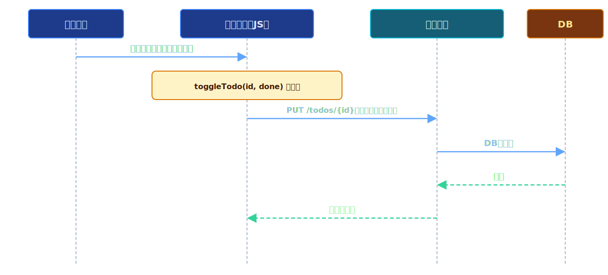

---


# 画面更新の流れ

## 操作のたびに一覧を再取得する（後半）

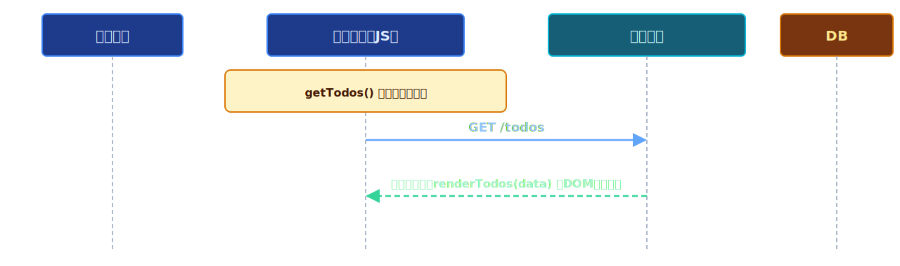

**ポイント:** 操作が完了したら **必ずサーバーから最新の一覧を取得し直す**。
これにより、画面とサーバーのデータが常に同期される。

---


# リロードしてもデータが残る！

```
これまで（第4回: フロントエンドのみ）:
  ┌──────┐  リロード  ┌──────┐
  │ TODO1│  ────→    │      │  ← データが消えた！
  │ TODO2│           │      │
  └──────┘           └──────┘

今回（フルスタック版）:
  ┌──────┐  リロード  ┌──────┐
  │ TODO1│  ────→    │ TODO1│  ← データが残っている！
  │ TODO2│           │ TODO2│
  └──────┘           └──────┘
       ↕                 ↕
  ┌──────────────────────────┐
  │  サーバー + SQLite        │
  │  データは常にDBに保存      │ ← ここにデータがあるから
  └──────────────────────────┘
```

---


# 実習5: PUT/DELETEの実装

## やること（10分）

1. `exercise/static/app.js` を開く
2. `toggleTodo` 関数の TODO コメント部分を実装:
   ```javascript
   await fetch(`/todos/${id}`, {
     method: "PUT",
     headers: { "Content-Type": "application/json" },
     body: JSON.stringify({ done: !done })
   });
   ```
3. `deleteTodo` 関数の TODO コメント部分を実装:
   ```javascript
   await fetch(`/todos/${id}`, { method: "DELETE" });
   ```

---


# 実習5: PUT/DELETEの実装（続き）

## 動作確認

4. ブラウザで動作確認:
   - チェックボックスで完了切替
   - 削除ボタンでTODO削除
5. **ページをリロードして、データが残っていることを確認！**

---


# 6. 静的ファイル配信

## なぜ静的ファイル配信が必要か

```
現在の状態:
  HTMLファイルを直接ブラウザで開いている
  → file:///path/to/index.html (fileプロトコル)
  → APIサーバーは http://localhost:8000
  → オリジンが違う → CORS設定が必要

理想の状態:
  FastAPIサーバーがHTMLも配信する
  → http://localhost:8000/ でHTMLが表示される
  → http://localhost:8000/todos でAPIも使える
  → 同じオリジン → CORS不要！
```

**静的ファイル配信** = HTML/CSS/JSファイルをFastAPIサーバーから返す仕組み

---


# FastAPIの StaticFiles 設定

```python
from fastapi import FastAPI
from fastapi.staticfiles import StaticFiles

app = FastAPI()

# 静的ファイル配信の設定
# "static" フォルダ内のファイルを "/" パスで配信する
# html=True により、/ アクセス時に index.html を自動で返す
app.mount("/", StaticFiles(directory="static", html=True), name="static")
```

---


# ファイル構成と配信の対応

```
exercise/
├── main.py          ← FastAPIサーバー
├── init_db.py       ← DB初期化
├── todo.db          ← SQLiteデータベース
└── static/          ← このフォルダを配信する
    ├── index.html   → http://localhost:8000/
    ├── style.css    → http://localhost:8000/style.css
    └── app.js       → http://localhost:8000/app.js
```

| ファイル | URL |
|---------|-----|
| static/index.html | http://localhost:8000/ |
| static/style.css | http://localhost:8000/style.css |
| static/app.js | http://localhost:8000/app.js |
| APIエンドポイント | http://localhost:8000/todos |

---


# 同一オリジンの利点

<div class="columns">
<div>

**配信前（異なるオリジン → CORS必要）**

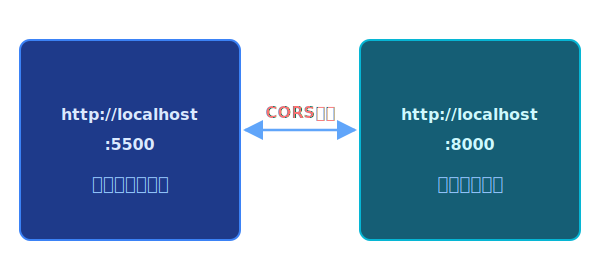

</div>
<div>

**配信後（同一オリジン → CORS不要！）**

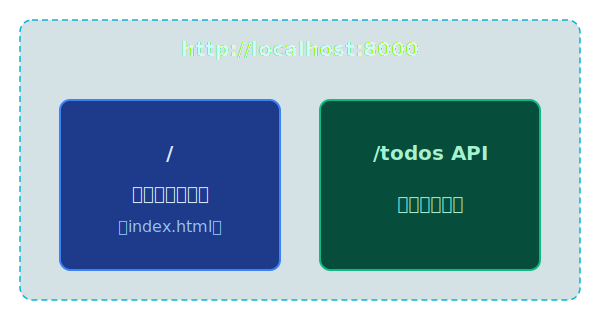

</div>
</div>

---


# 同一オリジン時のfetch

## URLの書き方が簡単になる

```javascript
// 異なるオリジンの場合（CORS必要）:
const response = await fetch("http://localhost:8000/todos");

// 同一オリジンの場合（CORS不要）:
const response = await fetch("/todos");
//                           ↑ サーバーのURLを省略できる！
```

同一オリジンから配信されていれば、**相対パス**でAPIを呼び出せる。
これはシンプルで、環境が変わっても動くため推奨される書き方。

---


# 実習6: 静的ファイル配信の設定

## やること（10分）

### Step 1: 静的ファイル配信の設定
1. `exercise/main.py` の静的ファイル配信の TODO コメントを実装:
   ```python
   app.mount("/", StaticFiles(directory="static", html=True), name="static")
   ```

---


# 実習6: 静的ファイル配信の設定（続き）

### Step 2: 動作確認
2. サーバーを再起動
3. ブラウザで `http://localhost:8000/` にアクセス
4. TODOアプリが表示されることを確認
5. TODO追加・完了・削除がすべて動作することを確認

### Step 3: Git commit & push
6. `git add . && git commit -m "第7回: TODOアプリフルスタック完成" && git push`

---

# 完成！TODOアプリの全体像


---

# 今回のまとめ

| 学んだこと | ポイント |
|-----------|---------|
| 全体アーキテクチャ | ユーザー操作→JS→HTTP→FastAPI→DB→JSON→DOM更新 |
| Fetch API (GET) | `fetch(url)` でデータ取得。`async/await` で非同期処理 |
| Fetch API (POST) | `method:"POST"`, `headers`, `body:JSON.stringify()` |
| CORS | 異なるオリジン間の通信制限。`CORSMiddleware` で解決 |
| PUT / DELETE | 完了切替と削除もfetchで実装。操作後に一覧再取得 |
| 静的ファイル配信 | `StaticFiles` でHTML/CSS/JSを配信。同一オリジンでCORS不要 |

---

# 次回予告: 第8回 セキュリティの基礎 & 総仕上げ

- XSS（クロスサイトスクリプティング）攻撃と対策
- SQLインジェクション攻撃と対策
- 入力バリデーション（Pydantic）
- エラーハンドリング
- TODOアプリの最終完成版

**今回作ったTODOアプリに「安全対策」を施して完全体にします！**

---

## 提出物

以下をフォームから提出してください:

1. `flow.md` のGitHubのURL
   - 例: `https://github.com/ユーザー名/リポジトリ名/blob/main/session07/exercise/flow.md`

2. `main.py` のGitHubのURL
   - 例: `https://github.com/ユーザー名/リポジトリ名/blob/main/session07/exercise/main.py`

